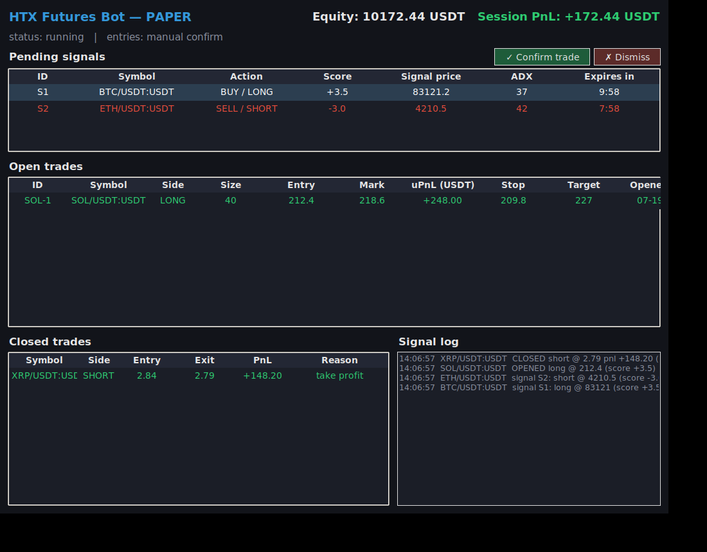

# HTX Futures Trading Bot

A trading bot for **HTX (former Huobi) USDT-margined perpetual futures**.
It combines five technical indicators into a confluence score, manages risk with
ATR-based stops and trailing stops, **emails you every time a signal fires and
every time a trade opens or closes**, and gives you a **desktop control panel**:
when a signal comes through it waits in the panel, and nothing is bought or sold
until you press **Confirm**.



> ⚠️ **Trading futures with leverage is extremely risky.** This bot can and will
> lose money in the wrong market conditions. It starts in **paper-trading mode**
> by default — keep it there until you have watched it trade for a while and
> understand its behavior. Never trade money you cannot afford to lose.

## Features

- **HTX futures connection** via [ccxt](https://github.com/ccxt/ccxt) — linear
  (USDT-margined) perpetual swaps, isolated or cross margin, configurable leverage
- **Multi-indicator strategy** — EMA crossover, MACD, RSI, Bollinger Bands and
  Stochastic each cast a weighted vote; a trade opens only when enough of them
  agree *and* the ADX trend filter and volume filter confirm
- **Risk management to cut losses**
  - position sized so a stopped-out trade loses a fixed % of equity (default 1%)
  - ATR-based stop-loss and take-profit (default 2×ATR stop, 2R target)
  - stop moves to breakeven at +1R, then trails price by ATR
  - per-symbol cooldown after a close, max open positions cap
  - daily loss circuit-breaker halts new entries
- **Signal confirmation control panel** — when the strategy fires, the signal
  appears in the GUI with **Confirm** and **Dismiss** buttons and you get an
  email; the buy/sell only happens after you press Confirm. Unconfirmed signals
  expire automatically (10 min default). Set `confirm_signals: false` for
  fully automatic entries.
- **Email alerts** on bot start, signal fired (so you know to go confirm it),
  trade open (with entry, stop, target and the signal reasons) and trade close
  (with realized PnL)
- **GUI control panel** (Tkinter) — pending signals with Confirm/Dismiss,
  equity, session PnL, open trades with live unrealized PnL, closed-trade
  history and the signal log
- **Paper-trading mode** (default) — trades a simulated balance against live HTX
  market data, no API keys needed
- Trade history appended to `trades.csv`

## Quick start

```bash
# 1. Install dependencies (Python 3.10+)
pip install -r requirements.txt

# 2. Create your config
cp config.example.yaml config.yaml

# 3. Run — starts in paper mode with the GUI
python run.py
```

That's it for paper trading: no API keys are required because market data is
public. The GUI opens, signals start appearing in the log, and simulated trades
show up in the tables.

Run on a server without a display:

```bash
python run.py --no-gui
```

## Going live (when you're ready)

1. Create an API key at HTX → **API Management**. Enable **trade** permission
   only — never withdrawals. Restrict it to your IP if possible.
2. Put the key in `config.yaml` (`exchange.api_key` / `api_secret`) or export
   `HTX_API_KEY` / `HTX_API_SECRET` instead. `config.yaml` is gitignored.
3. Set `trading.paper_trading: false`.
4. Start small: low leverage (2–5x), `risk_per_trade_pct: 1.0` or less.

## Email alerts

Set `email.enabled: true` in `config.yaml` and fill in the SMTP section. For
Gmail: enable 2-factor authentication, create an **App Password**
(Google Account → Security → App passwords) and use that as `smtp_password`.
Credentials can also come from `BOT_SMTP_USER` / `BOT_SMTP_PASSWORD` env vars.

You'll receive an email when the bot starts, every time a trade opens (entry,
size, stop, target and which indicators triggered it) and every time one closes
(exit price, realized PnL and the reason — stop loss, take profit, or signal flip).

## How the strategy works

Every closed candle, each indicator votes long (+weight), short (−weight) or
abstains (0):

| Indicator | Bullish vote | Bearish vote | Abstains when |
|---|---|---|---|
| EMA 9/21 | fast above slow | fast below slow | — |
| MACD histogram | positive (full weight if expanding) | negative | exactly zero |
| RSI 14 | 50–70 | 30–50 | overbought/oversold extremes |
| Bollinger 20/2 | above middle band | below middle band | outside the outer bands |
| Stochastic 14/3/3 | %K over %D below 80 | %K under %D above 20 | in its own extremes |

The votes sum to a score (−5…+5 with default weights). A **long** opens at
score ≥ 3, a **short** at ≤ −3 — but only if **ADX ≥ 20** (a real trend exists)
and volume is above its average (the move has participation). Indicators
abstaining in extremes means the bot avoids chasing exhausted, overextended moves.

### Signal confirmation flow

With `confirm_signals: true` (the default), a firing signal does **not** trade
immediately. Instead:

1. The signal appears in the control panel's **Pending signals** table
   (direction, score, price, ADX, expiry countdown) and you receive an email.
2. Press **✓ Confirm trade** to execute the buy (long) or sell (short) at the
   *current* market price — position sizing, stop-loss and take-profit are
   applied exactly as in automatic mode.
3. Press **✗ Dismiss** to skip it, or do nothing and it expires after
   `signal_expiry_minutes`.

Exits are always automatic — stop-loss, take-profit and trailing stops fire
without confirmation so a losing position is never left waiting for a click.
Note that confirmation mode needs the GUI running; in `--no-gui` mode signals
would just expire, so run headless setups with `confirm_signals: false`.

An open trade closes when:
- the **stop-loss** is hit (2×ATR from entry, sized to lose exactly your risk %),
- the **take-profit** is hit (2R by default),
- the **trailing stop** (breakeven after +1R, then ATR-trailing) is hit, or
- the confluence score **flips against** the position past `exit_score`.

Everything — periods, weights, thresholds, R-multiples — is tunable in
`config.yaml`.

## Project layout

```
run.py                 entry point (GUI + trading thread)
config.example.yaml    documented config template
bot/
  config.py            config loading/validation, env-var secrets
  exchange.py          HTX futures wrapper (ccxt)
  indicators.py        EMA, RSI, MACD, Bollinger, Stochastic, ATR, ADX
  strategy.py          confluence voting engine
  risk.py              position sizing, SL/TP, trailing stops
  trader.py            trading loop, paper & live brokers
  notifier.py          SMTP email alerts
  state.py             thread-safe shared state + trades.csv log
  gui.py               Tkinter dashboard
```

## Notes

- The GUI needs Tkinter (`sudo apt install python3-tk` on Debian/Ubuntu;
  included with Python on Windows/macOS). Without it the bot automatically
  falls back to headless mode.
- The bot only evaluates **closed** candles for entries, so it won't repaint;
  exits and trailing stops are checked every `poll_interval_sec` seconds.
- Paper fills are simulated at the current market price with taker fees; real
  fills will differ with slippage.

## Disclaimer

This software is provided for educational purposes. Nothing here is financial
advice. Past performance of any strategy does not guarantee future results.
You are solely responsible for any trades placed with your API keys.
